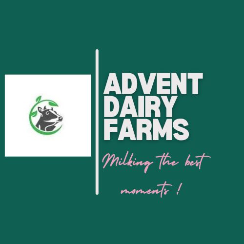

# Advent Dairy Farms - IoT-Enabled Dairy Solutions



> "Milking The Best Moments!"

## Overview

Advent Dairy Farms is a cutting-edge project that transforms traditional dairy farming through IoT technology and sustainable practices. This landing page showcases our innovative solutions for milk procurement and transportation across West Bengal and beyond.

## Features

Our digital dairy farm implements several innovative technologies:

- **IoT Tracking Bands** - Digital bands fastened to each animal's neck, connected to the JioGauSamriddhi app to monitor health, milk production, and consumption patterns
- **Automatic Brusher Machines** - Self-activating brushers that start rotating based on sensors from the animal's band
- **Automated Water Systems** - Smart taps that provide water when animals approach, based on signals from their IoT bands
- **Climate Control Foggers** - Advanced foggers to maintain optimal temperature in the farm environment
- **Automated Milking Systems** - State-of-the-art systems ensuring consistent quality and hygiene
- **Renewable Energy** - The entire farm operates on renewable energy sources
- **Health Monitoring** - Real-time health tracking of each animal

## Technology Stack

This project is built with:

- **React** - Frontend library for building the user interface
- **TypeScript** - For type-safe code
- **Vite** - Fast build tool and development server
- **Tailwind CSS** - Utility-first CSS framework for styling
- **Shadcn UI** - Component library for consistent design
- **Supabase** - Backend services and database
- **Lucide React** - Icon library

## Getting Started

### Prerequisites

- Node.js (v16 or higher)
- npm or yarn

### Installation

1. Clone the repository
   ```bash
   git clone <repository-url>
   cd dairy-digital-innovations
   ```

2. Install dependencies
   ```bash
   npm install
   # or
   yarn install
   ```

3. Start the development server
   ```bash
   npm run dev
   # or
   yarn dev
   ```

4. Open your browser and navigate to `http://localhost:5173`

## Building for Production

```bash
# Build the project
npm run build

# Preview the production build
npm run preview
```

## Project Structure

```
/
├── public/              # Static assets
├── src/
│   ├── components/      # UI components
│   ├── hooks/           # Custom React hooks
│   ├── integrations/    # Third-party integrations
│   ├── lib/             # Utility functions
│   ├── pages/           # Page components
│   ├── App.tsx          # Main application component
│   └── main.tsx         # Application entry point
├── supabase/            # Supabase configuration and functions
└── package.json         # Project dependencies and scripts
```

## Contact

- **Location:** Asansol, West Bengal, India
- **Email:** noel.regis04@gmail.com
- **Phone:** +91 7319546900

## Social Media

- [LinkedIn](https://www.linkedin.com/in/noel-regis-aa07081b1/)
- [GitHub](https://github.com/noelregis18)
- [Twitter](https://x.com/NoelRegis8)
- [Topmate](http://topmate.io/noel_regis)

## License

© 2024 Advent Dairy Farms. All rights reserved.